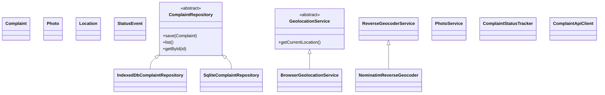
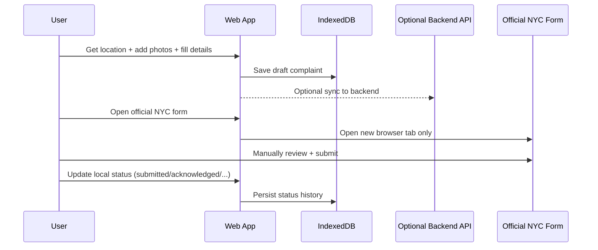

# Architecture

```mermaid
classDiagram
  class Complaint
  class Photo
  class Location
  class StatusEvent

  class ComplaintRepository {
    <<abstract>>
    +save(Complaint)
    +list()
    +getById(id)
  }

  class IndexedDbComplaintRepository
  class SqliteComplaintRepository

  class GeolocationService {
    <<abstract>>
    +getCurrentLocation()
  }

  class BrowserGeolocationService
  class ReverseGeocoderService
  class NominatimReverseGeocoder
  class PhotoService
  class ComplaintStatusTracker
  class ComplaintApiClient

  ComplaintRepository <|-- IndexedDbComplaintRepository
  ComplaintRepository <|-- SqliteComplaintRepository
  GeolocationService <|-- BrowserGeolocationService
  ReverseGeocoderService <|-- NominatimReverseGeocoder
```

```mermaid
sequenceDiagram
  participant U as User
  participant W as Web App
  participant IDB as IndexedDB
  participant API as Optional Backend API
  participant NYC as Official NYC Form

  U->>W: Get location + add photos + fill details
  W->>IDB: Save draft complaint
  W-->>API: Optional sync to backend
  U->>W: Open official NYC form
  W->>NYC: Open new browser tab only
  U->>NYC: Manually review + submit
  U->>W: Update local status (submitted/acknowledged/...)
  W->>IDB: Persist status history
```
