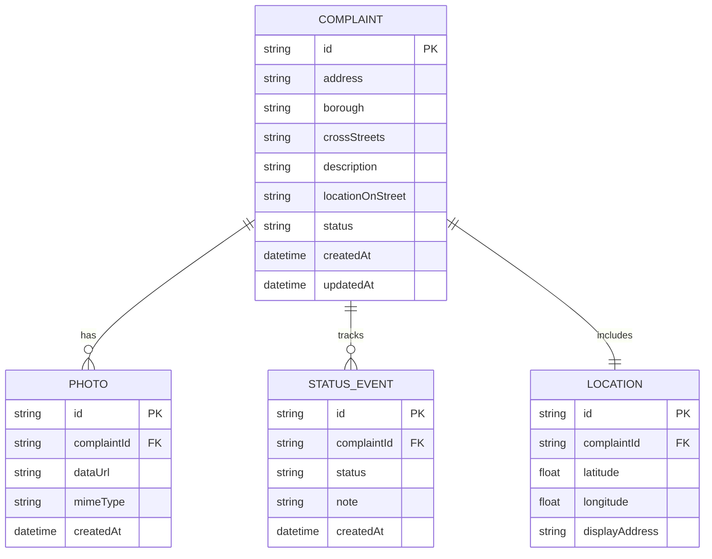

# Data Model

```mermaid
erDiagram
  COMPLAINT ||--o{ PHOTO : has
  COMPLAINT ||--o{ STATUS_EVENT : tracks
  COMPLAINT ||--|| LOCATION : includes

  COMPLAINT {
    string id PK
    string address
    string borough
    string crossStreets
    string description
    string locationOnStreet
    string status
    datetime createdAt
    datetime updatedAt
  }

  PHOTO {
    string id PK
    string complaintId FK
    string dataUrl
    string mimeType
    datetime createdAt
  }

  LOCATION {
    string id PK
    string complaintId FK
    float latitude
    float longitude
    string displayAddress
  }

  STATUS_EVENT {
    string id PK
    string complaintId FK
    string status
    string note
    datetime createdAt
  }
```
